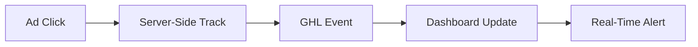

## Overview

Hello Conversions provides comprehensive tools to enhance your GoHighLevel (GHL) ad tracking. You gain accurate conversion tracking, precise attribution, customizable dashboards, and real-time analytics for revenue, traffic, and pipelines. Fix tracking issues caused by ad blockers and privacy restrictions in just 90 seconds.

<Callout kind="info">
  All features integrate seamlessly with GHL, Meta, Google Ads, and TikTok for complete visibility into your campaigns.
</Callout>

## Key Features

Explore the core capabilities that help you optimize ad spend and recover lost conversions.

<Columns cols={2}>
  <Card title="Conversion Tracking" icon="zap" href="/features/tracking">
    Capture every form submission, call, and sale despite ad blockers and iOS privacy limits.
  </Card>
  <Card title="Attribution" icon="trending-up" href="/features/attribution">
    Attribute revenue accurately to specific ads, campaigns, and sources.
  </Card>
  <Card title="Custom Dashboards" icon="bar-chart-3" href="/features/dashboards">
    Build tailored views for revenue, traffic, emails, and pipeline metrics.
  </Card>
  <Card title="Pipeline Analytics" icon="git-branch" href="/features/analytics">
    Monitor leads through stages with real-time traffic and conversion data.
  </Card>
</Columns>

## Conversion Tracking and Attribution

Set up tracking to see every conversion event. Hello Conversions uses server-side tracking to bypass client-side blockers.

<Tabs>
  <Tab title="JavaScript Snippet" icon="code">
    Add this script to your GHL site header.

    ```javascript
    (function(h,e,l,l,o,C,o,n,s){
      h.helloConversions = {account: 'YOUR_ACCOUNT_ID'};
      var s = document.createElement('script');
      s.src = 'https://cloud.helloconversions.com/tracker.js';
      s.async = true;
      document.head.appendChild(s);
    })(window,document);
    ```

  </Tab>
  <Tab title="GHL Workflow" icon="settings">
    Configure in your GHL workflows:

    ````json
    {
      "event": "form_submission",
      "user_id": "{{contact.id}}",
      "revenue": "{{custom.value}}"
    }
    ````

  </Tab>
</Tabs>

<Callout kind="tip">
  Test tracking with the demo endpoint: `POST https://api.example.com/track`.
</Callout>

## Custom Dashboards

Create and customize dashboards for your specific needs.

<Steps>
  <Step title="Access Dashboards" icon="monitor">
    Log in to `https://cloud.helloconversions.com` and navigate to Dashboards.
  </Step>
  <Step title="Add Widgets" icon="plus">
    Drag revenue, traffic, or pipeline widgets from the library.
  </Step>
  <Step title="Configure Filters" icon="sliders">
    Set date ranges and attribution models like first-click or last-click.
  </Step>
  <Step title="Share Dashboard" icon="share-2">
    Generate a public link or embed code for your team.
  </Step>
</Steps>

## Real-Time Event Visibility

Monitor events as they happen with this data flow:



## Revenue and Pipeline Analytics

Visualize your pipeline stages and metrics.

<Board title="Sample Pipeline Board">
  <BoardColumn title="New Leads" color="0" icon="user-plus">
    <BoardCard title="Meta Form Submit" description="Traffic: 150 | Conv: 12%" icon="facebook" dueDate="2024-12-31" />
  </BoardColumn>
  <BoardColumn title="In Pipeline" color="1" icon="loader-2">
    <BoardCard title="Google Call Booking" description="Value: $5,200" icon="phone" author="Sales Team" />
  </BoardColumn>
  <BoardColumn title="Closed Won" color="2" icon="check-circle">
    <BoardCard title="TikTok Sale" description="Revenue: $2,100" icon="dollar-sign" createdAt="2024-12-15" />
  </BoardColumn>
</Board>

## Next Steps

<Card title="Start Tracking" icon="play" href="/quickstart" horizontal>
  Follow the quickstart to set up in 90 seconds.
</Card>

<Card title="Integrations" icon="link" href="/integrations" horizontal>
  Connect Meta, Google, and TikTok.
</Card>

<Expandable title="Advanced Analytics Configuration" default-open="false">

Use custom queries for deeper insights:

````sql
SELECT 
  campaign, 
  SUM(revenue) as total_rev,
  COUNT(*) as conversions
FROM events 
WHERE date > '2024-12-01'
GROUP BY campaign;
````

</Expandable>